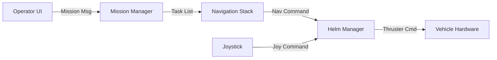

# UNH Marine Autonomy System Architecture

## Overview
The **UNH Marine Autonomy** system is a modular framework for Autonomous Surface Vehicle (ASV) control and multi-vehicle mission planning and execution. It was originally known as "Project11".

## Core Components
The system is composed of several independent ROS 2 nodes that work together to provide autonomy capabilities.

| Component | Description |
| :--- | :--- |
| **Mission Planner (CAMP)** | Desktop Operator UI for defining missions, monitoring status, and visualizing data. |
| **Mission Manager** | On-vehicle executive node. Receives missions and orchestrates execution by issuing tasks. |
| **Navigation Stack** | A Behavior Tree (BT) based system that receives tasks (e.g., "Survey Area") and generates low-level navigation commands. |
| **Helm Manager** | Control arbitration node. Switches between Manual (Joystick) and Autonomous modes. Ensures only one controller drives the hardware. |
| **UDP Bridge** | Robust, low-bandwidth communications link between the vehicle and the operator station. |

## Data Flow
The high-level data flow from operator to hardware is:

## Repository Structure (Planned)

### 1. `unh_marine_autonomy`
The central monorepo for core robot capabilities.
*   `marine_autonomy`: Core launch files and system configuration.
*   `marine_interfaces`: Standard message definitions.
*   `mission_manager`: Autonomy executive.
*   `helm_manager`: Control arbitrator.
*   `command_bridge`: Shore-side communications.
*   `joy_to_helm`: Joystick Adapter.

### 2. `unh_marine_navigation`
The Guidance, Navigation, and Control connection.
*   `marine_nav_behaviors`: Path following and specific behaviors.
*   `marine_nav_interfaces`: Internal navigation messages.

### 3. `camp` & `s57_tools`
*   `camp`: The operator interface (Qt Application).
*   `s57_tools`: Tools for handling Chart data (S-57/S-63).

### 4. Hardware Interfaces
*   `udp_bridge`: Communications link.
*   `marine_ais`: AIS data handling.

## Robot Configuration
Each specific robot (e.g., "Ben") has its own configuration package (e.g., `ben_marine`) containing:
*   URDF / Mesh descriptions.
*   Specific launch files (sensor drivers, hardware interface selection).
*   Parameter configurations.
