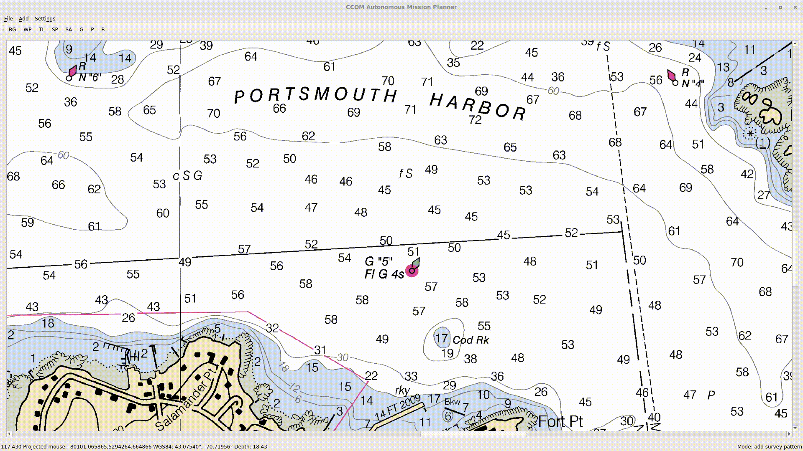

# Package: marine_autonomy
 
 > **Note**: This is the documentation for the `marine_autonomy` ROS 2 package. For the full framework documentation, please see the [Repository Root](../README.md).
 
 # Project11: A mapping focused open-sourced software framework for Autonomous Surface Vehicles

The Project 11 framework was developed as a backseat driver for Autonomous Surface Vehicles
(ASVs). Key design features include the ability to quickly and easily specify survey plans; monitoring of mission progress, even
over unreliable wireless networks; and to provide an environment to develop advanced autonomous technologies.

## Quick Start Guide

### System requirements

On an Ubuntu 24.04 system, install ROS2 Jazzy including the developer tools following instructions on the ROS website.

https://docs.ros.org/en/jazzy/Installation.html

A system with decent performance is required. While testing in a virtual machine (vm) using VirtualBox on an Ubuntu host with 32G of ram, an Intel i7-10875H processor and an NVidia graphics card, I needed to set the vm to have 16G of ram, 8 CPUs and enabled 3D acceleration to reduce timeout errors while running the simulation.

### Installation and launch

Once ROS2 Jazzy is installed, you can quickly install and run Project11 with the following:

    mkdir -p ~/project11/jazzy_ws/src
    cd ~/project11/jazzy_ws/src
    git clone https://github.com/CCOMJHC/project11.git -b jazzy

    # If rosdep is not installed:
    # sudo apt-get install python3-rosdep 
    sudo rosdep init
    rosdep update

    # If vcs is not installed:
    # sudo apt-get install python3-vcstool   
    vcs import < project11/config/repos/simulator.repos
    
    rosdep install --from-paths . --ignore-src -r -y

    cd ..
    source /opt/ros/jazzy/setup.bash
    colcon build --symlink-install
    
    source install/setup.bash

    # download nautical charts
    cd ..
    mkdir data
    cd data
    wget https://charts.noaa.gov/ENCs/02Region_ENCs.zip
    unzip 02Region_ENCs.zip

    ROS_S57_ENC_ROOT=~/project11/data/ENC_ROOT ros2 launch project11_simulation simulator_launch.py

Two windows should appear, CAMP and RViz. RViz can seem to freeze when loading the robot model. Be patient.

In the CAMP window, zoom out with the mouse wheel to find the boat. Right click on a target area and select "Hover here" to have the boat go into autonomous mode, transit to the location, and hover in place once it gets there.
    
## Major components and concepts

A typical setup has a ROS nodes running on the robot with some key nodes including the `mission_manager`, the `helm_manager` and the `udp_bridge`. The operator station also runs  a `udp_bridge` node as well as `camp`, the CCOM Autonomous Mission Planner which provide a planning and monitoring interface.

### Operator user interface - CAMP

The [CCOM Autonomous Mission Planner](../../../camp), also known as CAMP, displays the vehicle's position on background georeferenced charts and maps. It also allows the planning of missions to be sent to the vehicle and to manage the vehicle's piloting mode.

### UDP Bridge - udp_bridge

The [UDP Bridge](../../../udp_bridge) sends select ROS topics between ROS cores. It allows control and monitoring over wireless unreliable networks.

### Mission Manager - mission_manager

The [Mission Manager](../../../mission_manager) receives missions from CAMP and executes them. It also handles requests such as hover.

### Helm Manager - helm_manager

The [Helm Manager](../../../helm_manager) controls which commands get sent to the underlying hardware. It reacts to changes in piloting mode by sending messages to the piloting mode enable topics and only allowing incoming control messages from the current piloting mode to be sent to the hardware interface.

### Piloting modes

Project11 operates in 3 major piloting modes: "manual", "autonomous" and "standby". 

In "manual" mode, the vehicle responds to commands sent from a device such as a joystick or a gamepad. The commands are converted to "helm" messages by the `joy_to_helm` node and are sent from the operator station to the vehicle via the `udp_bridge`.

In "autonomous" mode, the `mission_manager` sends mission items to the navigation stack and responds to override commands such as the hover command that can allow the vehicle to station keep for a while, then resume the mission when the hover is canceled.

The "standby" mode is used to when no control commands are to be sent by Project11.

### Navigation Stack

The `mission_manager` receives and executes the higher level missions. Depending on the task, track lines may be sent to the `path_follower` or another node will receive a higher level directive, such as "survey this area", and generate and send out track lines or other navigation segments to lower level planners or controllers.
Eventually, a "helm" or "cmd_velocity" message gets sent to the autonomous/helm or autonomous/cmd_vel topic reaching the `helm_manager`. 
