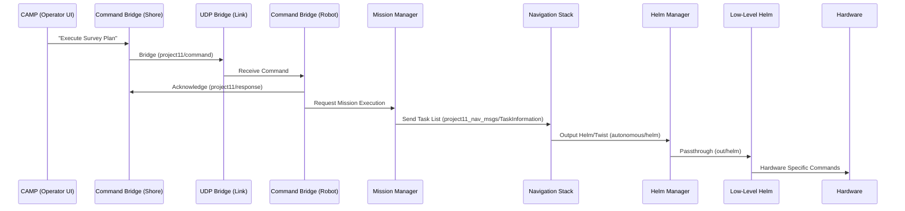
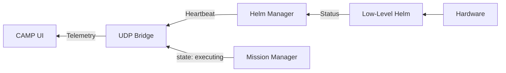

# UNH Marine Autonomy System Architecture

## Overview
The **UNH Marine Autonomy** system (aka **Project11**) is a modular framework for Autonomous Surface Vehicle (ASV) control and multi-vehicle mission planning and execution. It prioritizes reliability over unreliable networks and abstracts hardware specifics to support heterogeneous fleets.

## Core Concepts

### 1. Reliable Command Bridging (`udp_bridge` & `command_bridge`)
In marine environments, telemetry links (Radio, Cellular, Satellite) are often intermittent. To ensure commands (like "Hover" or "Start Mission") are received, the system uses a "Send-Until-Acknowledged" pattern.
- **`udp_bridge`**: Handles the low-level transport of ROS messages over UDP, optimized for bandwidth.
- **`command_bridge`**: Sits on top of the bridge. It queues commands with a timestamp and republishes them until the remote side sends a matching acknowledgment.

### 2. Hardware Agnosticism (Low-Level Helm Nodes)
To keep the core framework agnostic of specific vehicle hardware (different thruster configurations, steering types, etc.), the architecture uses **Low-Level Helm Nodes**.
- **Core Framework**: Outputs generic `Helm` or `Twist` messages.
- **Platform-Specific Node**: (e.g., `ben_helm`, `dory_helm`) Subscribes to these generic commands and translates them into specific thruster setpoints or serial commands for that vehicle.
- **Benefit**: Changing vehicles only requires swapping one low-level node.

## Data Flows

### 1. Mission Planning & Execution Flow
How a mission goes from the operator's clicks to the vehicle's movement:

### 2. Status Feedback Flow
How the operator knows what the robot is doing:

## Piloting Modes & Arbitration
The **`helm_manager`** is the "brain" that decides who is currently driving the vehicle. It arbitrates between three primary modes:

| Mode | Trigger | Description |
| :--- | :--- | :--- |
| **Standby** | Default / "Stop" | No control signals are sent to the hardware. Safest state. |
| **Manual** | Joystick Input | Commands from a local or remote joystick (`joy_to_helm`) are passed through. |
| **Autonomous** | Mission Start | Signals from the `mission_manager` and Navigation Stack are passed through. |

The `helm_manager` ensures that if the user grabs a joystick, the system can quickly switch to Manual, or if a mission is aborted, it returns to Standby.

## Component Map

| Component | Role |
| :--- | :--- |
| **CAMP** | Planning interface & Situational Awareness. |
| **Mission Manager** | High-level executive; converts plans to discrete navigation tasks. |
| **Navigation Stack** | Path planners and followers; handles the "physics" of getting there. |
| **Helm Manager** | Safety-critical arbitrator of control sources. |
| **Command Bridge** | Reliable transaction layer for critical commands. |
| **UDP Bridge** | Efficient data transport for remote operations. |
